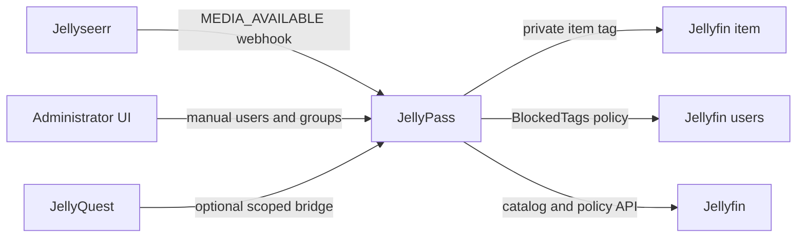

# JellyPass

[](https://github.com/nicklongmore86/jellypass/actions/workflows/ci.yaml)
[](LICENSE)
[](https://github.com/nicklongmore86/jellypass/pkgs/container/jellypass)

**Private media access for shared Jellyfin servers.**

JellyPass connects Jellyseerr requests to Jellyfin's native tag-based access
policies. When requested media becomes available, JellyPass keeps it visible to
the requester and blocks it for other non-administrator users. It also provides
an administrator UI for retroactive access assignment, reusable household
groups, household-specific Jellyfin hostnames, and an optional request bridge
for [JellyQuest for Tizen](https://github.com/nicklongmore86/jellyquest-tizen).

JellyPass is independent, community-maintained software. It is not affiliated
with or endorsed by Jellyfin, Seerr, or Jellyseerr.

> [!CAUTION]
> JellyPass changes Jellyfin item tags and complete user-policy documents. Test
> with non-critical users and media first, keep a backup of the state file, and
> retain a separate Jellyfin administrator recovery path.

## What it does

- Converts Jellyseerr `MEDIA_AVAILABLE` webhooks into durable access grants.
- Protects movies, complete series, and locally associated trailers.
- Preserves unrelated Jellyfin tags and blocked tags.
- Lets administrators assign users or reusable groups to existing library
  items, individually or in batches of up to 500.
- Reconciles tags and policies after transient failures or user changes.
- Maintains a searchable Jellyfin catalog without automatically making every
  catalog item private.
- Provides household URLs whose login picker exposes only that household's
  public users and preserves their password prompt after profile selection.
- Proxies household media requests, byte ranges, HLS requests, and WebSockets.
- Optionally gives JellyQuest a narrowly scoped, server-side Jellyseerr session.
- Exposes health and Prometheus metrics endpoints.

JellyPass does **not** replace Jellyfin authentication, manage downloads, or
decide whether a Jellyseerr request should be approved. Jellyseerr remains the
request and acquisition authority; Jellyfin remains the playback authorization
authority.

## How access enforcement works



For each protected title, JellyPass:

1. Creates one stable tag derived from the Jellyfin item ID, such as
   `jfa:private:8f...`.
2. Adds that tag to the movie or series and its known local trailers.
3. Adds the tag to `BlockedTags` for every non-administrator Jellyfin user except
   the request owner, manually assigned users, and members of assigned groups.
4. Persists the desired grant in `grants.json` and periodically reconciles it.

Administrator accounts are never blocked. Existing, unmanaged media remains
public to users whose normal Jellyfin policy allows it.

### Catalog items are not grants

The **Library** tab is an inventory of movies and series discovered during a
Jellyfin catalog sync. The **Grants** tab contains only titles that JellyPass is
actively protecting.

A newly downloaded or newly scanned item does not become a grant merely because
it appears in the catalog. A grant is created by one of these events:

- JellyPass receives Jellyseerr's `MEDIA_AVAILABLE` webhook for a request.
- A JellyQuest user makes a self-service access claim.
- An administrator assigns access from the Library tab or API.

Library upgrades, replacements, manual downloads, and titles that Jellyseerr
already considered available before JellyPass was installed may not produce a
new webhook. Assign those items from the Library tab if they should be private.

## Requirements

- Jellyfin 10.11 or newer.
- Seerr or Jellyseerr with webhook support and Jellyfin-linked users.
- A Jellyfin administrator API key.
- Docker with Compose v2 for the recommended installation, or Node.js 22+ and
  pnpm for a source installation.
- A persistent, private location for `grants.json`.

Jellyseerr is optional only if every webhook includes the Jellyfin media and user
IDs and the JellyQuest bridge, recent-request cards, and Jellyseerr user import
are not needed.

## Quick start with Docker Compose

Create a directory and download the public deployment files:

```sh
mkdir jellypass && cd jellypass
curl -LO https://raw.githubusercontent.com/nicklongmore86/jellypass/main/compose.yaml
curl -Lo .env https://raw.githubusercontent.com/nicklongmore86/jellypass/main/.env.example
mkdir -m 700 data
```

Edit `.env` and replace every placeholder. Generate two different secrets, for
example:

```sh
openssl rand -hex 32
openssl rand -hex 32
```

Start JellyPass:

```sh
docker compose up -d
docker compose ps
curl http://127.0.0.1:8787/health
```

The default Compose file binds JellyPass only to `127.0.0.1:8787`. Keep that
default when a reverse proxy runs on the same machine. Change the published
address deliberately if Jellyseerr or a reverse proxy must reach it over a
private network.

The container image is published from `main` as `latest` and from release tags
as semantic-version tags. For predictable production upgrades, set
`JELLYPASS_IMAGE` in `.env` to a versioned image such as:

```dotenv
JELLYPASS_IMAGE=ghcr.io/nicklongmore86/jellypass:1.0.0
```

Until the first versioned release is published, use `latest` or build from
source.

### Build locally instead

Clone the repository, create `.env`, and use the source-build example:

```sh
git clone https://github.com/nicklongmore86/jellypass.git
cd jellypass
cp .env.example .env
# Edit .env.
docker compose -f compose.example.yaml up --build -d
```

## Configuration

JellyPass reads configuration from environment variables at startup.

| Variable | Required | Default | Description |
| --- | --- | --- | --- |
| `JELLYFIN_URL` | Yes | — | Base URL reachable from JellyPass, without a trailing slash. |
| `JELLYFIN_API_KEY` | Yes | — | Jellyfin administrator API key used for catalog, tag, and policy operations. |
| `WEBHOOK_TOKEN` | Yes | — | Secret accepted by `/webhooks/seerr`. Use a long random value. |
| `ADMIN_TOKEN` | Recommended | `WEBHOOK_TOKEN` | Separate bearer token for administrative APIs and metrics. |
| `SEERR_URL` | Conditional | — | Seerr/Jellyseerr base URL reachable from JellyPass. Configure with `SEERR_API_KEY`. |
| `SEERR_API_KEY` | Conditional | — | Seerr/Jellyseerr API key. Configure with `SEERR_URL`. |
| `JELLYQUEST_BRIDGE_ENABLED` | No | `false` | Enables the scoped JellyQuest bridge. Requires Seerr/Jellyseerr configuration. |
| `STATE_FILE` | No | `./data/grants.json` | Durable state-file path. The container uses `/app/data/grants.json`. |
| `HOST` | No | `0.0.0.0` | HTTP listen address inside the process/container. |
| `PORT` | No | `8787` | HTTP listen port. |
| `RECONCILE_INTERVAL_SECONDS` | No | `300` | Retry/reconciliation interval; `0` disables scheduling. Maximum `86400`. |
| `CATALOG_SYNC_INTERVAL_SECONDS` | No | `3600` | Jellyfin catalog refresh interval; `0` disables scheduling. Maximum `604800`. |
| `HOUSEHOLD_DOMAIN` | No | — | Enables household hostnames below this DNS domain. |
| `HOUSEHOLD_HOST_PREFIX` | No | `jelly-` | Prefix placed before each DNS-safe group ID. |
| `JELLYPASS_IMAGE` | Compose only | `ghcr.io/nicklongmore86/jellypass:latest` | Container tag used by `compose.yaml`. |
| `JELLYPASS_ENV_FILE` | Compose only | `.env` | Alternate environment-file path used by either Compose file. |

`SEERR_URL` and `SEERR_API_KEY` must be set together. `ADMIN_TOKEN` falls back
to `WEBHOOK_TOKEN` for backward compatibility, but using different values limits
the impact of a leaked webhook URL or notification configuration.

### Network addresses

Container-local `localhost` refers to the JellyPass container itself. Use a
shared Docker network and service names such as `http://jellyfin:8096`, a private
LAN address, or `host.docker.internal` where your Docker setup supports it.

JellyPass must be able to reach Jellyfin and, when configured, Jellyseerr. Those
services need to reach JellyPass only as follows:

- Jellyseerr needs `/webhooks/seerr`.
- Administrators need `/admin/` and the administrative API.
- Household and JellyQuest clients need the full household origin.

## Configure Jellyseerr

The requesting Jellyseerr account must be imported from or linked to Jellyfin.
A local-only account without a Jellyfin user ID cannot receive a Jellyfin grant.

In **Settings → Notifications → Webhook**:

1. Enable the webhook agent.
2. Select only **Request Available**.
3. Set the URL to `http://jellypass:8787/webhooks/seerr` for a shared Docker
   network, adjusting the host for your installation.
4. Set the authorization header to `Bearer YOUR_WEBHOOK_TOKEN` when the
   Jellyseerr version supports it.
5. Use the payload below.

```json
{
  "notificationType": "{{notification_type}}",
  "media": {
    "jellyfinMediaId": "{{media_jellyfinMediaId}}",
    "mediaType": "{{media_type}}"
  },
  "request": {
    "id": "{{request_id}}",
    "requestedBy": {
      "jellyfinUserId": "{{requestedBy_jellyfinUserId}}",
      "username": "{{requestedBy_username}}"
    }
  }
}
```

Some Jellyseerr releases do not expose Jellyfin IDs as webhook template
variables. When `SEERR_URL` and `SEERR_API_KEY` are configured, this smaller
payload is sufficient because JellyPass resolves the request through the API:

```json
{
  "notificationType": "{{notification_type}}",
  "request": { "id": "{{request_id}}" }
}
```

If the notification UI cannot add an authorization header, append
`?token=YOUR_WEBHOOK_TOKEN` to the webhook URL. Query strings can appear in
proxy logs, browser history, and diagnostics, so keep this route private and
prefer the bearer header whenever possible.

After configuration, use Jellyseerr's test function if available. A test event
that is not `MEDIA_AVAILABLE` is expected to return `202` with an ignored status.

## Administrator UI

Open `http://127.0.0.1:8787/admin/` or the protected HTTPS URL exposed by your
reverse proxy. Sign in with an enabled Jellyfin administrator account.

JellyPass sends credentials directly to Jellyfin, immediately closes the
temporary Jellyfin session, and stores only an in-memory JellyPass session for
12 hours. Restarting JellyPass signs browser sessions out.

The UI contains four views:

- **Dashboard** — grant counts, synchronization health, and recent Jellyseerr
  requests linked to the synchronized catalog.
- **Library** — catalog search, filters, sorting, pagination, and bulk access
  assignment for up to 500 selected items.
- **Grants** — active automated and manual grants, owners, groups, sync status,
  dry-run plans, and revocation.
- **Groups** — reusable audiences, household URLs, and optional Jellyfin user
  creation/import.

Run a catalog sync after first installation. Assigning access from the Library
tab creates a manual grant; catalog synchronization alone does not.

## Household Jellyfin URLs

Access groups can also act as households. With:

```dotenv
HOUSEHOLD_DOMAIN=example.com
HOUSEHOLD_HOST_PREFIX=jelly-
```

the group ID `farmhouse` receives the URL
`https://jelly-farmhouse.example.com`. On that hostname, JellyPass filters
Jellyfin's public-user response to the group's members and proxies supported
Jellyfin HTTP, streaming, byte-range, HLS, and WebSocket traffic.

Deployment requirements:

- Point each hostname, or a suitable wildcard DNS record, at the reverse proxy.
- Use a TLS certificate covering each hostname; `*.example.com` covers the
  single-label format above.
- Preserve the original `Host` header.
- Forward WebSocket upgrades and byte-range requests.
- Avoid proxy buffering for large media responses.
- Do not expose the JellyPass listener directly to untrusted clients.
- Keep a separate normal Jellyfin administrator/recovery origin.

Unknown household hostnames fail closed with `404`. Group IDs used as household
IDs must contain lowercase letters, numbers, and hyphens and be no longer than
63 characters.

Filtering the login picker is a privacy and usability boundary, not
authentication. Users still authenticate with Jellyfin, and Jellyfin policies
remain authoritative. Quick Connect and legacy-login restrictions are described
in [the household access design](docs/household-access.md).

## Optional JellyQuest request bridge

Enable the bridge only with valid Jellyseerr configuration:

```dotenv
SEERR_URL=http://jellyseerr:5055
SEERR_API_KEY=replace-with-a-seerr-api-key
JELLYQUEST_BRIDGE_ENABLED=true
```

JellyQuest loads:

```text
https://jelly-household.example.com/jellyquest-bridge/bridge.html
```

JellyPass verifies that the selected Jellyfin profile maps to a Jellyseerr user,
signs that profile into Jellyseerr server-side, and stores the Jellyseerr cookie
only in memory for 12 hours. The random browser token is limited to discovery,
search, media status, title details, request creation, and authenticated
self-service access claims. Restarting JellyPass clears bridge sessions but not
persisted claims.

The bridge applies per-client rate limits to eligibility checks and session
creation. Place it behind the same trusted TLS reverse proxy as the household
origin.

## Operations

### Health and logs

```sh
curl http://127.0.0.1:8787/health
curl http://127.0.0.1:8787/jellyquest-bridge/health # when enabled
docker compose logs --tail=100 jellypass
```

`/health` reports process liveness. It does not guarantee that Jellyfin or
Jellyseerr is reachable; use the UI synchronization status and logs for that.

### Administrative API examples

All examples except health require `Authorization: Bearer $ADMIN_TOKEN`.

```sh
# Inspect grants.
curl -H "Authorization: Bearer $ADMIN_TOKEN" \
  http://127.0.0.1:8787/v1/grants

# Preview reconciliation without changing Jellyfin.
curl -X POST -H "Authorization: Bearer $ADMIN_TOKEN" \
  'http://127.0.0.1:8787/v1/reconcile?dryRun=true'

# Reapply desired tags and policies.
curl -X POST -H "Authorization: Bearer $ADMIN_TOKEN" \
  http://127.0.0.1:8787/v1/reconcile

# Prometheus metrics.
curl -H "Authorization: Bearer $ADMIN_TOKEN" \
  http://127.0.0.1:8787/metrics
```

### Backup and restore

The state file is the only JellyPass application data that must persist. It
contains grants, access groups, claims, synchronization status, Jellyfin user
IDs, and a catalog containing media names and IDs. Protect it as private data.

For a consistent filesystem backup:

```sh
docker compose stop jellypass
cp -p data/grants.json data/grants.json.backup
docker compose start jellypass
```

Also back up Jellyfin independently. JellyPass can reconcile its desired state,
but it is not a backup of Jellyfin users, metadata, or policies.

To restore, stop JellyPass, replace `data/grants.json` with the backup, ensure
the container user can read and write it, start JellyPass, preview a global
reconciliation, and then apply it.

### Upgrade

For the prebuilt image:

```sh
docker compose pull
docker compose up -d
curl http://127.0.0.1:8787/health
```

Back up the state file first. Read release notes before changing between
versioned tags. Pinning `JELLYPASS_IMAGE` makes rollback explicit:

```sh
JELLYPASS_IMAGE=ghcr.io/nicklongmore86/jellypass:PREVIOUS_VERSION docker compose up -d
```

For a source build, fast-forward the repository and rebuild:

```sh
git pull --ff-only
docker compose -f compose.example.yaml up --build -d
```

## Troubleshooting

### A new download appears in Library but not Grants

This is expected when no grant-creating event occurred. Common causes are:

- The file was downloaded manually or outside Jellyseerr.
- It replaced or upgraded media Jellyseerr already considered available.
- The request became available before JellyPass or its webhook was configured.
- The Jellyseerr account is not linked to a Jellyfin user.
- The webhook is disabled, uses the wrong event type, cannot reach JellyPass, or
  has the wrong token.

Catalog sync does not backfill grants from historical requests. Assign the item
from Library for immediate protection.

### Webhook returns `401`

The bearer header or `token` query value does not exactly match
`WEBHOOK_TOKEN`. Confirm that whitespace was not copied into either value.

### Webhook reports missing Jellyfin IDs

Configure `SEERR_URL` and `SEERR_API_KEY` and use the request-ID-only payload.
Also confirm that the requester was imported from Jellyfin.

### Library is empty or stale

Check Jellyfin reachability and API-key privileges, then run **Sync library** in
the UI. Confirm that `CATALOG_SYNC_INTERVAL_SECONDS` is not `0` if automatic
refreshes are expected.

### A household hostname returns `404`

Confirm the group exists, its ID is DNS-safe, `HOUSEHOLD_DOMAIN` and
`HOUSEHOLD_HOST_PREFIX` match the hostname, and the reverse proxy preserves the
original `Host` header.

### Changes do not reach every user

Open Grants, preview reconciliation, inspect the reported changes, and apply
them. Check logs for a failed Jellyfin policy update. Adding a new Jellyfin user
requires reconciliation so existing private tags are added to that user's
blocked-tag policy.

## API reference

| Method | Path | Purpose |
| --- | --- | --- |
| `GET` | `/health` | Public process liveness. |
| `POST` | `/webhooks/seerr` | Authenticated Jellyseerr availability webhook. |
| `GET` | `/v1/grants` | List grants and synchronization state. |
| `GET` | `/v1/grants/{itemId}/plan` | Preview changes for one grant. |
| `DELETE` | `/v1/grants/{itemId}/requests/{requestId}` | Revoke one request owner; supports `?dryRun=true`. |
| `PUT` | `/v1/grants/{itemId}/groups` | Replace assigned groups; supports `?dryRun=true`. |
| `PUT` | `/v1/grants/{itemId}/manual` | Set manual users/groups; supports `?dryRun=true`. |
| `GET` | `/v1/groups` | List groups and generated household URLs. |
| `PUT` | `/v1/groups/{groupId}` | Create or replace a group. |
| `DELETE` | `/v1/groups/{groupId}` | Delete a group and reconcile affected grants. |
| `GET` | `/v1/users` | List Jellyfin users. |
| `POST` | `/v1/users` | Create a non-administrator Jellyfin user and assign a group. |
| `GET` | `/v1/requests/recent` | List recent Jellyseerr requests linked to the catalog. |
| `GET` | `/v1/requests/poster` | Authenticated Jellyseerr poster proxy. |
| `GET` | `/v1/library` | Read the synchronized catalog. |
| `POST` | `/v1/library/sync` | Refresh the catalog from Jellyfin. |
| `GET` | `/v1/library/search?q=...` | Search Jellyfin directly. |
| `GET` | `/v1/library/poster?itemId=...` | Authenticated Jellyfin poster proxy. |
| `PUT` | `/v1/library/access` | Assign one audience to up to 500 items; supports `?dryRun=true`. |
| `POST` | `/v1/reconcile` | Reconcile all grants; supports `?dryRun=true`. |
| `GET` | `/metrics` | Prometheus metrics. |

Administrative routes accept `ADMIN_TOKEN` bearer authentication or a valid
administrator browser session. Request bodies are limited to 64 KiB.

## Security and privacy

- Keep Jellyfin and Jellyseerr API keys out of Git, logs, screenshots, and
  support requests.
- Use different random webhook and administrator tokens.
- Put browser, household, and remote webhook traffic behind TLS.
- Expose only the routes each network needs; the admin bearer token grants full
  administrative API access.
- Preserve `Host` only through a reverse proxy you control. Household routing
  relies on the HTTP host authority.
- Restrict state-file and backup permissions; they contain media names and
  Jellyfin user identifiers.
- Maintain a separate Jellyfin administrator recovery origin.
- Review [SECURITY.md](SECURITY.md) and report vulnerabilities privately through
  GitHub Security Advisories.

JellyPass stores no Jellyfin passwords, supplied new-user passwords, Jellyfin
access tokens, or Jellyseerr API responses containing credentials. Browser and
JellyQuest sessions are held in memory and disappear on restart.

## Limitations

- Jellyfin exposes no transaction spanning item tags and multiple user policies.
  A partial failure can temporarily leave an item visible until reconciliation
  succeeds.
- There is a small fail-open window between Jellyfin discovering media and
  JellyPass processing the availability webhook.
- Series access applies to the complete series, not individual seasons.
- Direct filesystem, DLNA, administrator, and other out-of-band access is
  outside JellyPass's scope.
- Jellyseerr does not currently emit a deletion event containing everything
  JellyPass needs for automatic revocation; use the UI or API.
- Concurrent policy edits in another administrator interface can race with a
  JellyPass update. Reconciliation restores JellyPass-owned blocked tags.
- Historical Jellyseerr requests are not automatically imported as grants.
- Household profile filtering is not passwordless SSO. See
  [docs/household-access.md](docs/household-access.md) for the design boundary.

## Development

```sh
corepack enable
pnpm install --frozen-lockfile
pnpm check
pnpm test
pnpm build
```

The runtime uses only Node.js standard-library modules. TypeScript and Node type
definitions are development dependencies.

CI performs type checking, unit and HTTP integration tests, a production
container build, and an integration test against Jellyfin 10.11.3. To run the
real-Jellyfin test locally, start an equivalent fresh Jellyfin container with
`test/fixtures` mounted at `/media`, then run:

```sh
JELLYFIN_REAL_URL=http://127.0.0.1:18096 pnpm test:real
```

See [CONTRIBUTING.md](CONTRIBUTING.md) before opening a pull request.

## Releases and free distribution

JellyPass is free and open-source software under the [MIT License](LICENSE). You
may use, copy, modify, and redistribute it subject to that license.

Every push to `main` publishes a multi-architecture `latest` container to GitHub
Container Registry. A tag such as `v0.3.0` publishes `0.3.0`, `0.3`, `0`, and
`latest` container tags and creates a GitHub Release with generated notes.
Images target `linux/amd64` and `linux/arm64`.

Maintainers must make the GHCR package public after its first publication:
**GitHub profile → Packages → jellypass → Package settings → Change visibility
→ Public**. Public GHCR images can then be pulled without authentication.

## License

[MIT](LICENSE) © 2026 JellyPass contributors.
